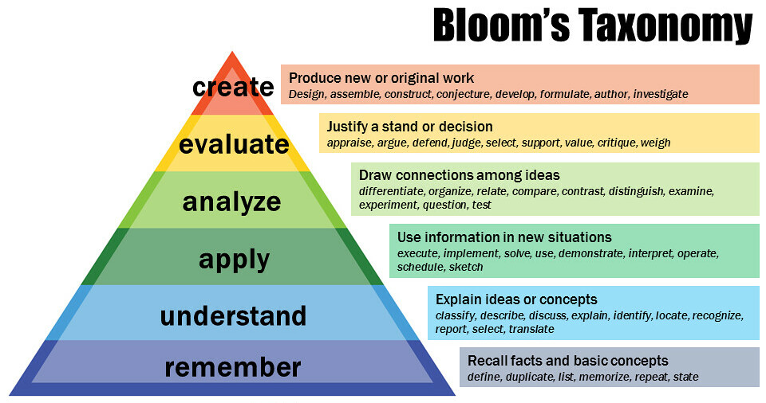

1. [Topics](#1)
2. [Lab](#2)
3. [Books](#3)
4. [Exercise](#4)
5. [Sample question](#5)
6. [Assignment](#6)
7. [Project by Students](#7)
8. [Cool Links](#8)

 
 

# 1. Syllabus: 

#### UNIT 01
Introduction: Concept of WWW, Internet and WWW, HTTP Protocol : Request and
Response, Web browser and Web servers, Features of Web 2.0 Web Design: Concepts of
effective web design, Webdesign issues including Browser, Bandwidth and Cache, Display
resolution, Look and Feel of the Web
site, Page Layout and linking, User centric design, Sitemap, Planning and publishing website,
Designing effective navigation.

#### UNIT 02
HTML :Basics of HTML, formatting and fonts, commenting code, color, hyperlink, lists,
tables, images, forms, XHTML, Meta tags, Character entities, frames and frame sets,
Browser architecture and Web site structure. Overview and features of HTML5

#### UNIT 03
Style sheets : Need for CSS, introduction to CSS, basic syntax andstructure, using CSS,
background images, colors and properties,manipulating texts, usingfonts, borders and boxes,
margins, padding lists,positioning using CSS, CSS2, Overview and features of CSS3
JavaScript : Client side scriptingwith JavaScript, variables, functions, conditions, loops and
repetition, Pop up boxes, Advance JavaScript: Javascript and objects, JavaScript own objects,
the DOM and web browser environments, Manipulation using DOM, forms and
validations,DHTML : Combining HTML, CSS andJavascript, Events and buttons

#### UNIT 04
XML : Introduction to XML, uses of XML, simple XML, XML keycomponents, DTD
andSchemas, Using XML with application. Transforming XML using XSL and XSLT PHP:
Introduction and basic syntax of PHP, decision and looping with examples, PHP and HTML,
Arrays, Functions, Browser control and detection, string, Form processing, Files, Advance
Features: Cookies and Sessions, Object Oriented Programming with PHP

#### UNIT 05
PHP and MySQL:Basic commandswith PHP examples, Connection to server, creating
database, selecting a database, listing database, listing table names,creating a table, inserting
data, altering tables, queries, deleting database, deleting data and tables, PHP myadmin and
databasebugs

 
 

# 2. 🧪 Lab

 
 

# 3. 📚 Books

### REFERENCES:

1.Developing Web Applications, Ralph Moseley and M. T. Savaliya, Wiley-India
2.Web Technologies, Black Book, dreamtech Press
3.HTML 5, Black Book, dreamtech Press
4.Web Design, Joel Sklar, Cengage Learning
5.Developing Web Applications in PHP and AJAX, Harwani, McGrawHill
6.Internet and World Wide Web How to program, P.J. Deitel & H.M. Deitel , Pearson

 
 

# 4. Exercise

1. Exercise & Practice [click me](https://github.com/joysmith/Global-Engineering-College/blob/main/3%20Sem%20-IoT%20-OOPM%20/assets/exercise/index.md)

 
 

# 5. Sample question

1. Download sample paper [click me]()

 
 

# 6. Assignment

 
 

# 7. Project

# 8. Cool Links

1. [Way back machine](https://web.archive.org/)

