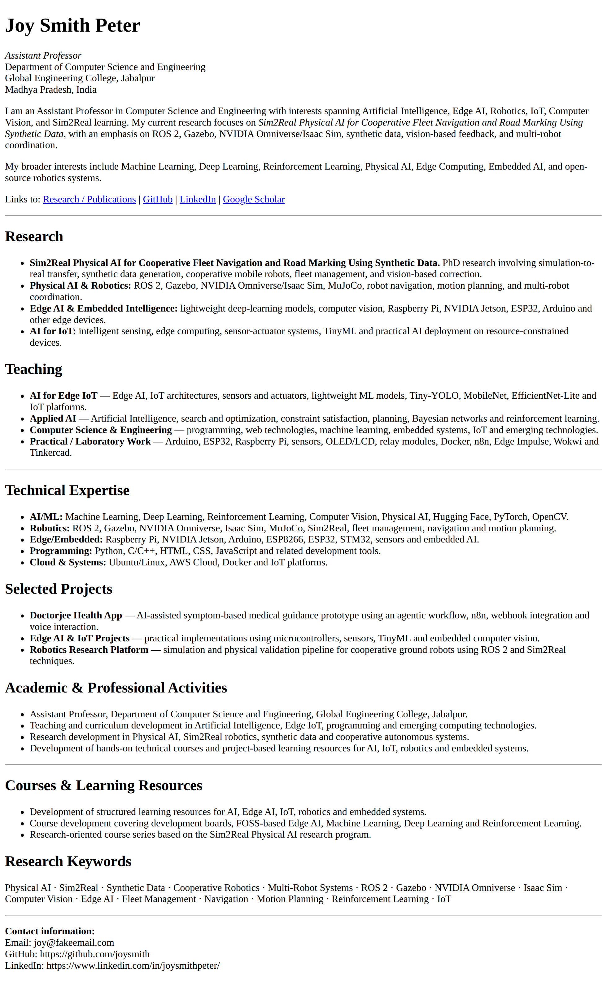

## Documentation
1. [MDN](https://developer.mozilla.org/en-US/docs/Web/HTML/Reference/Elements/Heading_Elements)
2. [W3School](https://www.w3schools.com/html/html_headings.asp)

<br>
<br>


## Setting Up the dev environment
1. Download the [Vs code](https://code.visualstudio.com/download?_exp_download=fb315fc982)
2. Vs code Extension
    - esbenp.prettier-vscode
    - formulahendry.auto-close-tag
    - hex-ci.stylelint-plus
    - dbaeumer.vscode-eslint
    - naumovs.color-highlight
    - ritwickdey.LiveServer
    - erikphansen.vscode-toggle-column-selection
    - file-icons

<br>
<br>


## 1. Basics of HTML

- The head-tag SECTION tell's browser, what this web page is all about

```html
<!DOCTYPE html>
<html>
<head>
    <title>My First HTML Page</title>
</head>
<body>
    <h1>Welcome to HTML</h1>
    <h2>Learning the Basics</h2>
    <p>This is a paragraph. HTML uses tags to structure content.</p>
    <hr>
    <p>Line one<br>Line two, right after a break.</p>
</body>
</html>
```


1. How to give heading to html

    - [mdn](https://developer.mozilla.org/en-US/docs/Web/HTML/Element/Heading_Elements)
    - [w3s](https://www.w3schools.com/html/html_headings.asp)

1. [How to give break to lines](https://developer.mozilla.org/en-US/docs/Web/HTML/Element/br#:~:text=Technical%20summary-,%3A%20The%20Line%20Break%20element,division%20of%20lines%20is%20significant "mdn")

1. [How to put horizonal line](https://developer.mozilla.org/en-US/docs/Web/HTML/Reference/Elements/hr)


1. [What are HTML <meta> Tag inside head section, used by chrome](https://www.w3schools.com/tags/tag_meta.asp)

1. [How to use paragraph tag](https://www.keybr.com/)[Typing practice](https://developer.mozilla.org/en-US/docs/Web/HTML/Element/p)

1. [How to italic text using emphasis tag](https://developer.mozilla.org/en-US/docs/Web/HTML/Element/em)

1. [How to bold text using strong tag](https://developer.mozilla.org/en-US/docs/Web/HTML/Element/strong)

1. [How to make bullet list using unordered list tag](https://developer.mozilla.org/en-US/docs/Web/HTML/Element/ul)

1. [How to make ordered list](https://developer.mozilla.org/en-US/docs/Web/HTML/Element/ol)

1. [How to insert image in webage](https://developer.mozilla.org/en-US/docs/Web/HTML/Element/img)

1. [How to use anchor tag](https://developer.mozilla.org/en-US/docs/Web/HTML/Element/a)


<br>

### Objective: Design a simple resume



